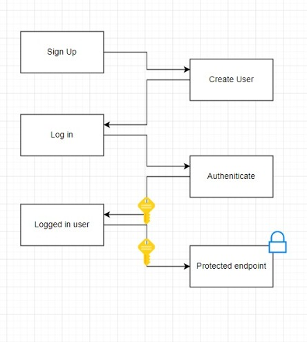

# authorization_server
Python project in which users can sign up and login to authenticate. Users obtain a JWT token which authorizes them to resource API.

## Screenshot of virtual environment usage:

## Flowchart:

## Points of improvement:
The main points to improve on, if one were to realize this projects are:

1. A proper database instead of a list containing users. 
A database can store users offline, and the server does not need to be running. 
Also a database is obviously much more secure and faster.
2. More thorough testing. The login and sign up endpoints could be tested
if you mocked the 3rd party functions and classes.
3. A proper UI. The current UI now uses the UI provided by the FastAPI framework.
4. Encrypted keys. The secret is now stored in the config.yaml file, but 
an encrypted key could be stored instead. Alternatively github.com provides
secrets, but these can only be used when github actions are used.

## How to run
To run the FastAPI app run 
> uvicorn main:app --reload

To run the tests, from the project's root directory run
> python -m pytest tests/
