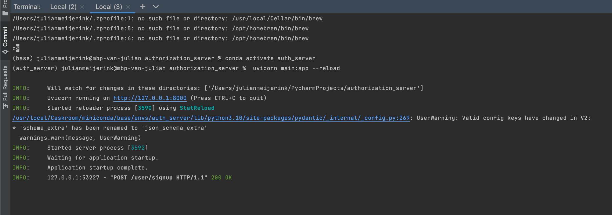

# authorization_server
Python project in which users can sign up and login to authenticate. Users obtain a JWT token which authorizes them to resource API.

## Screenshot of virtual environment usage:

